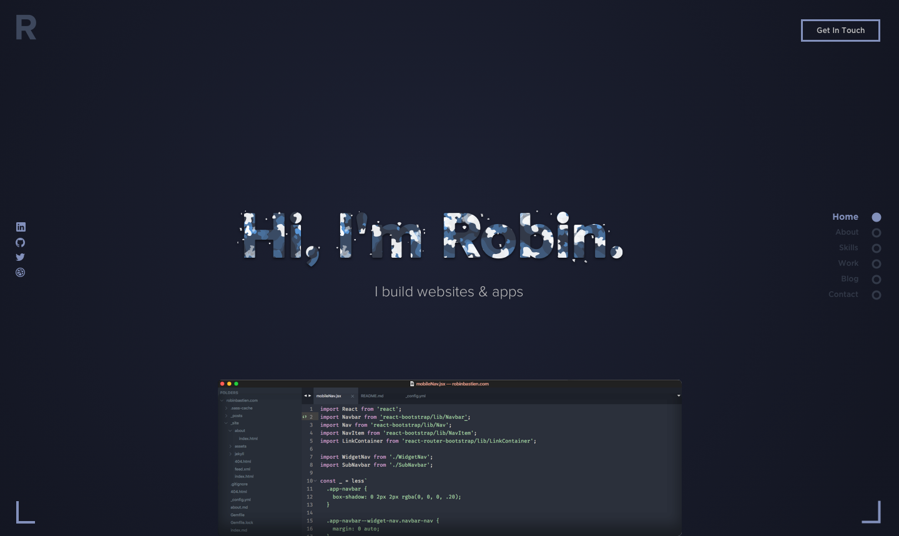

# Personal Website for Robin Bastien

## Tools Used
- Jekyll (Github Pages)
- SASS
- CSS Flexbox-Grid
- Icomoon (For Icon Font Generation)
- ESLint (AirBnb Config)
- Snap.SVG
- Vue.JS

## Running
```bash
jekyll serve --watch
```


## Preview



## Changelog
[View the Changelog](CHANGELOG.md)